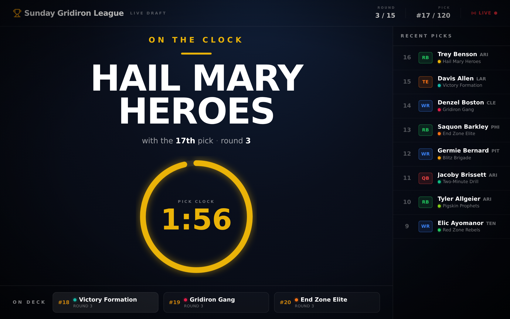
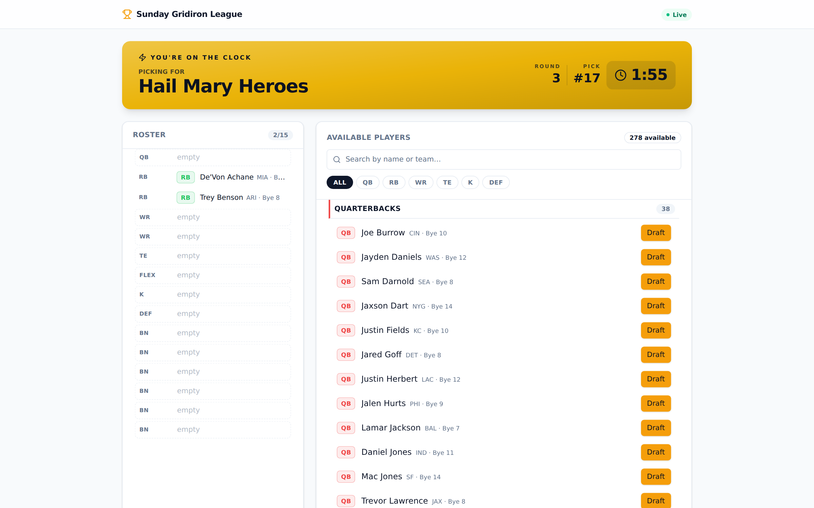
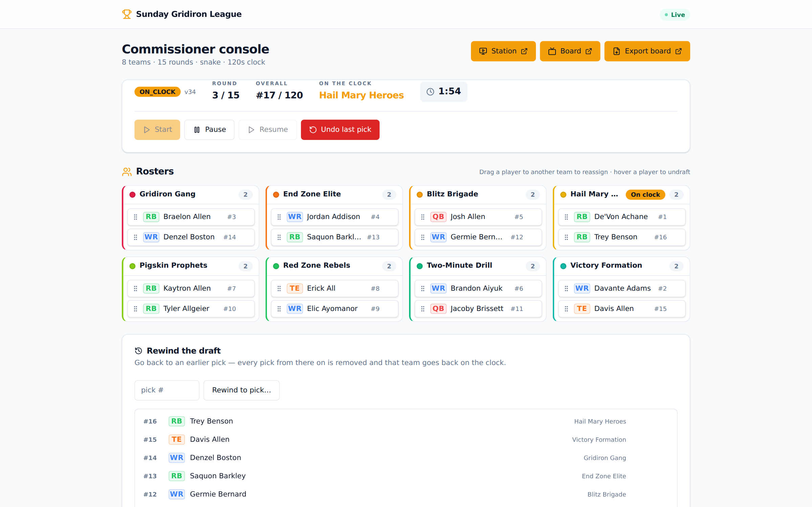
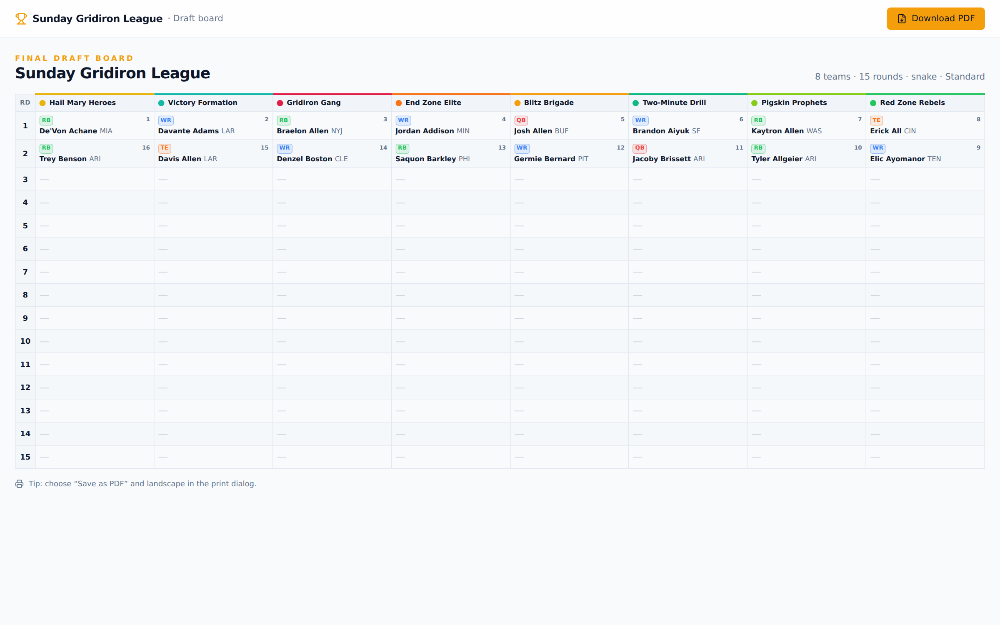
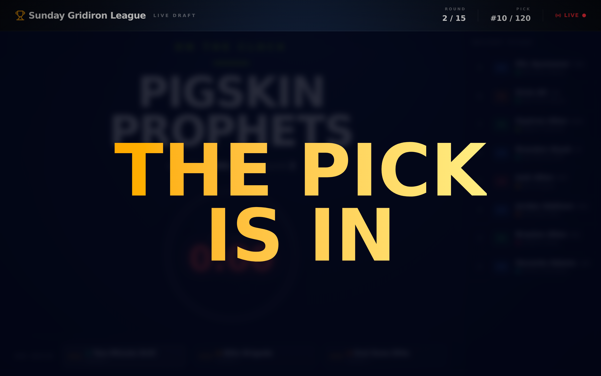

# OpenDraft

[](LICENSE)
[](https://github.com/kmbush/OpenDraft/actions/workflows/ci.yml)

**Open-source draft tool for in-person fantasy football leagues.** Run your league's annual draft in the
room — on the big screen and on laptops at the table — self-hosted on AWS. Modeled loosely on Sleeper's
conventions.

> Status: **MVP working.** Setup, live draft (station + board), admin controls, the draft-order reveal,
> theming, and PDF export are built and runnable end-to-end with a local no-AWS harness. Architecture and
> rationale live in [`docs/DESIGN.md`](docs/DESIGN.md); coding standards in [`CONVENTIONS.md`](CONVENTIONS.md).
> To run a real draft, see [`docs/RUNNING-A-DRAFT.md`](docs/RUNNING-A-DRAFT.md).

## Screenshots

**The draft board (TV):** a broadcast-style stage with a live countdown ring, on-deck queue, and a
recent-picks rail — plus a full-screen "the pick is in" takeover between picks.



<table>
  <tr>
    <td width="50%"><br /><sub><b>Player station (laptop)</b> — picks for whoever is on the clock; players listed by position only, never by rank/ADP.</sub></td>
    <td width="50%"><br /><sub><b>Commissioner console</b> — live status, per-team rosters, and mid-draft controls (undo, rewind, reassign).</sub></td>
  </tr>
  <tr>
    <td width="50%"><br /><sub><b>Post-draft board</b> — a print-ready, themeable grid you can save as PDF.</sub></td>
    <td width="50%"><br /><sub><b>The announcement</b> — the board takes over the room after every pick.</sub></td>
  </tr>
</table>

## What it does

- **Draft setup** (admin console) — configure teams (name, color, optional owner), roster format, rounds,
  snake vs. linear, pick timer, the "pick is in" waiting window, a go-live countdown, and per-league
  branding (name, accent color, logo).
  - **Roster formats** — one-click presets (**Standard / Superflex / IDP / 2-QB**) plus a per-slot editor
    for QB/RB/WR/TE/K/DEF, FLEX/SUPERFLEX/IDP-FLEX, IDP starters (DL/LB/DB), and bench.
- **Draft order** — set it manually, randomize it, or run **The Reveal**: an animated envelope lottery on
  the board that unveils the order to the whole room at once (blind even to the commissioner).
- **Live draft, two screens**
  - **Player station** (laptop): the on-the-clock team's roster-so-far and every available player, listed
    **only by position + alphabetically** with NFL team & bye week — **never by ADP or draft value**
    (deliberate: the tool must not influence your picks). Position-filter pills, name/team search, and
    confirm-before-draft. If the clock hits zero, a **legal random auto-pick** is made.
  - **Draft board** (TV): who's on the clock with a countdown ring, on-deck queue, recent picks, and the
    "the pick is in → the pick announced → on the clock: next team" broadcast sequence (stations lock during
    it). A server-authoritative deadline keeps every screen's clock in sync.
- **Admin controls, mid-draft** — pause/resume, undo, rewind to any pick, undraft a player, reassign a pick
  between teams, and (after a draft completes) start a new one pre-filled from the last league.
- **Post-draft** — the final board plus a print-ready, themeable **PDF export**.

## Design principles baked in

- **Runs on flaky venue wifi** — the player pool is cached locally; screens re-sync fully on reconnect.
- **Server-authoritative clock** — every screen renders the same deadline; the server never ticks.
- **Near-zero idle cost** — serverless; you pay pennies for the days you actually draft.
- **No ranking signal, ever** — value data is stripped from the pool at build time, not just hidden in the UI.
- **Tenant-ready** — designed so a future hosted multi-tenant SaaS can be layered on without a rewrite.

## Stack (see `docs/DESIGN.md` for rationale)

React 19 + TypeScript + Tailwind v4 (Vite) frontend · TypeScript Lambdas · API Gateway WebSocket + HTTP ·
DynamoDB · S3 + CloudFront · Terraform. Player pool sourced from the public Sleeper API and snapshotted for
offline use. The draft engine is a pure TypeScript state machine shared verbatim by the server authority and
the browser.

## Local dev quickstart (no AWS)

A local harness runs the whole draft on `localhost` with in-memory adapters — timer auto-picks and all.

**Prerequisites:** Node 20+ and pnpm 9+.

```sh
pnpm install
pnpm --filter @opendraft/pool build:snapshot   # once, if the bundled snapshot is missing
pnpm dev                                        # harness (:8787) + Vite (:5173)
```

Then open **<http://localhost:5173/admin>**, sign in with the dev passcode **`draft2026`**, and create a
draft (use pool id **`bundled`**). Open `/board` and `/station` to draft. Details and a full walkthrough:
[`tools/dev-server/README.md`](tools/dev-server/README.md) and [`docs/RUNNING-A-DRAFT.md`](docs/RUNNING-A-DRAFT.md).

## Repository layout

```
apps/web/            React app: /station /board /admin /export
services/engine/     Pure draft state machine (shared client + server)
services/api/        Lambda handlers (WebSocket + HTTP) via ports & adapters
services/pool/       Sleeper snapshot builder + bundled fallback
packages/shared/     Shared domain types & message contracts
tools/dev-server/    Local no-AWS harness (reuses services/api core)
infra/               Terraform (DynamoDB, API Gateways, Lambdas, S3/CloudFront, …)
docs/DESIGN.md       Architecture & decisions
docs/RUNNING-A-DRAFT.md  Commissioner's operator guide
CONVENTIONS.md       Coding standards
```

## Deploying to AWS

Self-host on your own AWS account with Terraform. See [`infra/README.md`](infra/README.md) for the
deployment runbook.

### Deploying your own instance — what stays private

This repository is **deployment-agnostic on purpose**: it contains no account IDs, domains, secrets, or
Terraform state. Everything specific to *your* instance lives outside the repo. Keep it that way — split
your deployment into three tiers by sensitivity:

**1. Non-secret config → your own private repo.** Create a private repo (e.g. `opendraft-deploy`) holding
the values that configure *your* stack but should never ship in the public code:

```
opendraft-deploy/
  prod.auto.tfvars     # env, region, league_id, domain_name, acm_certificate_arn
  backend.hcl          # your S3 backend bucket/key/region (see infra/backend.tf)
  .env.production       # VITE_* values, taken from `terraform output`
  set-secrets.sh        # commands that push secrets to SSM — not the secrets themselves
  RUNBOOK.md            # your deploy steps, DNS notes, gotchas
```

Point Terraform at this repo's `infra/` and feed it your private vars:
`terraform apply -var-file=../opendraft-deploy/prod.auto.tfvars`.

**2. Actual secrets → SSM Parameter Store (SecureString) + a password manager.** Never commit
`admin_passcode_hash` or `session_hmac_key` — not even to the private repo. The root Terraform variables
default to `REPLACE_ME_*` placeholders and expect the real values to be set out-of-band after `apply`
(see [`infra/README.md`](infra/README.md)). Store the plaintext only in your vault; keep the *script* that
sets them in the private repo, not the values.

**3. Terraform state → a private, encrypted, versioned S3 backend.** State files embed account IDs, ARNs,
and sometimes secrets, so they must never be public. The default backend is local (state on your laptop);
[`infra/backend.tf`](infra/backend.tf) documents the exact one-time migration to an S3 + DynamoDB-lock
backend — recommended once you run a real draft, so state is durable and not tied to one machine.

Guard rails already in place: `infra/.gitignore` excludes `*.tfstate`, `*.auto.tfvars`, and `.terraform/`;
`.gitignore` excludes `.env` and build artifacts. `terraform.tfvars.example` and `apps/web/.env.example`
show every value as a placeholder — copy them, fill in your own, and keep the copies out of this repo.

## Status & roadmap

MVP is working end-to-end (setup, live draft, admin console, reveal, theming, PDF). Multi-tenant SaaS is
designed-for but deferred. Full phase breakdown in [`docs/DESIGN.md`](docs/DESIGN.md#13-phased-roadmap).

## Contributing

Contributions are welcome — see [`CONTRIBUTING.md`](CONTRIBUTING.md) for the workflow, and
[`CONVENTIONS.md`](CONVENTIONS.md) for coding standards and the project's hard invariants. Be excellent to
each other ([`CODE_OF_CONDUCT.md`](CODE_OF_CONDUCT.md)); report security issues privately per
[`SECURITY.md`](SECURITY.md).

## License

**[MIT](LICENSE).** Use, modify, self-host, and share OpenDraft freely, including in commercial projects —
just keep the copyright notice. Provided as-is, without warranty. See [`LICENSE`](LICENSE) for the full text.
</content>
</invoke>
