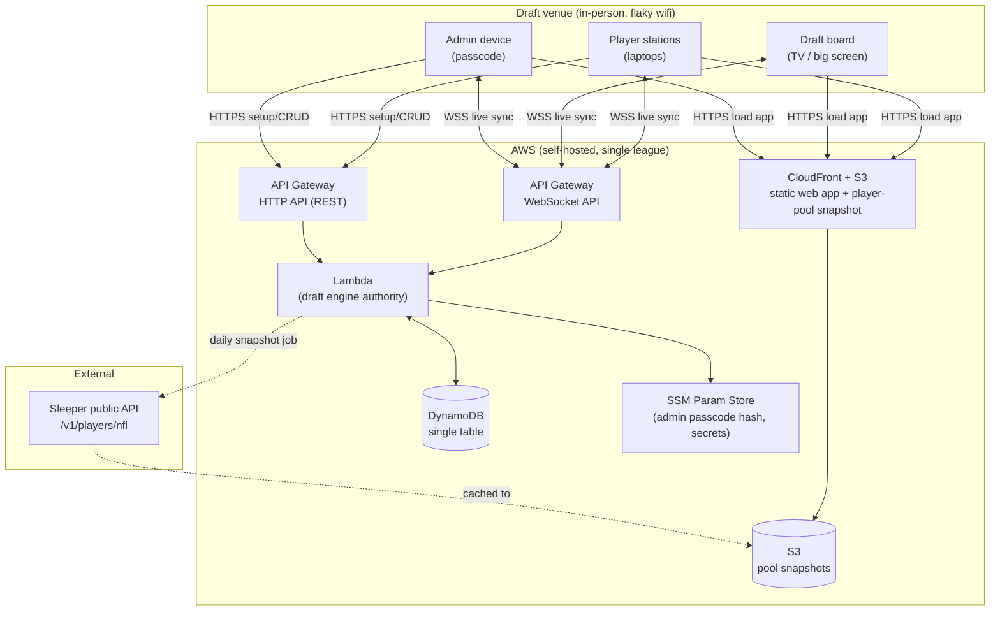
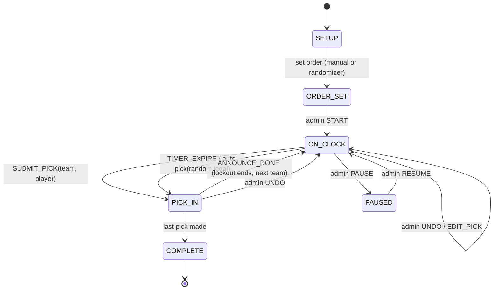
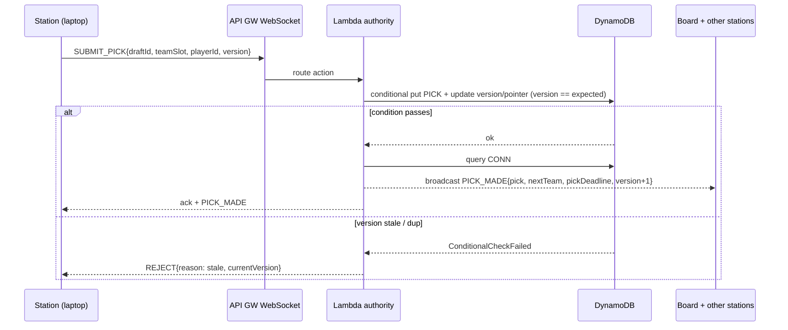
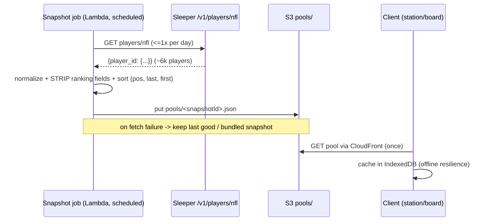

# OpenDraft — Design Document

> Living design doc. This is the source of truth for architecture decisions.
> Every decision records **what was chosen, what was rejected, and why.**
>
> Status: Kickoff / pre-implementation. Owner: project maintainer. Last updated: 2026-07-03.

---

## 1. System Overview & Goals

**OpenDraft** is an open-source tool for **in-person ("offline") fantasy football leagues** to run their
annual draft. It is modeled loosely on Sleeper's conventions. The owner self-hosts it on AWS.

### The three pillars

1. **Draft setup** — an admin configures the year's draft: number of teams, roster/format
   (QB/RB/WR/TE/FLEX/K/DEF/bench, roster size, rounds), snake vs. linear, pick-timer length. Draft order
   is chosen either manually or via an animated **randomizer "game"** (random reveal).
2. **Live draft** — two real-time screen types kept in sync:
   - **Player station** (a laptop at a table): the player's roster-so-far plus the full pool of available
     players. **HARD CONSTRAINT: the available list is ordered ONLY by position + alphabetical, NEVER by
     ADP / typical draft position.** Select a player → **Draft** → added to their team.
   - **Draft board** (big screen / TV): who's on the clock, current round, recent picks, time remaining.
     On a pick: a **"the pick is in"** announcement/animation, then a **brief waiting period** before the
     next team goes live.
3. **Post-draft** — view the full board and **export a PDF**. Modern theme, **customizable per league**
   (colors / logo / name).

### Goals

- A real league can run a complete draft end-to-end, in a room, on flaky venue wifi.
- One-command-ish self-host on AWS at **near-zero idle cost** (the tool is used a handful of days per year).
- **Tenant-ready from day one:** schema and boundaries let a future hosted multi-tenant SaaS be layered on
  **without a rewrite** (see §10).

### Non-goals (now)

- No player accounts / player auth (in-person; you take your seat when the board shows you're on the clock).
- No multi-tenant SaaS, billing, or hosted signup **yet** (designed for, not built now).
- No auction drafts or pick trading in MVP. **No keepers/dynasty in MVP — but the data model is deliberately built to accommodate them later** (redraft only now; keeper-ready schema, see §4).
- Not a season-long league manager — **draft day only.**

---

## 2. Architecture at a Glance

Three logical planes with clean boundaries:

| Plane | Responsibility | Where it lives |
|---|---|---|
| **Transactional draft state** | Draft settings, teams, pick log, on-the-clock pointer, timer deadline | DynamoDB (single table) |
| **Player pool snapshot** | The ~6k-player NFL pool, cached for offline use, ranking fields stripped | S3 object + client-side IndexedDB cache |
| **Static frontend** | Station / board / admin UI (one React bundle) | S3 + CloudFront |

Compute is **AWS Lambda** behind **two API Gateway APIs**: a **WebSocket API** (live draft sync) and an
**HTTP API** (setup CRUD, pool fetch). The **draft engine** is a pure, transport-agnostic TypeScript module
shared between the Lambda authority and the browser.

### 2.1 System boundary diagram



### 2.2 Component-relationship diagram

```mermaid
flowchart LR
    subgraph web["apps/web (one React/Vite bundle)"]
        route["Route shell + Zustand store + WS client"]
        station["/station view"]
        board["/board view"]
        admin["/admin view"]
        print["/export print view"]
        route --- station & board & admin & print
    end

    subgraph shared["packages/shared"]
        types["TS types + message contracts"]
    end

    subgraph engine["services/engine (pure)"]
        sm["Draft state machine<br/>reduce(state, event) -> {state, outbox}"]
    end

    subgraph api["services/api (Lambda)"]
        wsh["WS handlers<br/>connect / sync / action / disconnect"]
        resth["HTTP handlers<br/>league / draft / teams / pool"]
    end

    subgraph pool["services/pool"]
        fetch["Sleeper fetch + snapshot builder"]
    end

    web -->|imports| shared
    web -->|imports (client-side validation)| engine
    api -->|imports (authority)| engine
    api -->|imports| shared
    wsh <--> DDB[("DynamoDB")]
    resth <--> DDB
    fetch --> S3[("S3 pool")]
    web -->|loads pool| S3
```

---

## 3. Architecture Decisions

Each decision is stated as **Chosen / Rejected / Why**. The default stack is assumed unless a deviation is
called out with `DEVIATION`.

### AD-1 — Real-time transport & timer authority ⭐ (the pivotal decision)

**Chosen: API Gateway WebSocket API + Lambda + DynamoDB, with a *deadline-timestamp* clock model.**

**Rejected:**
- **Always-on service (Fargate/ECS or EC2) holding connections + a ticking timer in memory.**
- Polling / long-polling over the HTTP API.
- Server-Sent Events (one-directional; we need client→server actions too).

**Why.** The persona's serverless defaults are pressured here by two needs: a *persistent connection* and a
*server-authoritative timer*. We evaluated both paths honestly:

- The dominant real-world cost factor is **idle time** — this tool is used a few days per year and sits idle
  the rest. Serverless idle cost is effectively **$0** (DynamoDB on-demand, Lambda, S3/CloudFront, and the
  WebSocket API all bill per use). An always-on Fargate task **plus an ALB** is **~$25–35/month for 365 days
  to serve ~3 days** of actual work. For a self-hosted hobby tool, that is the wrong trade.
- The usual serverless objection is timer authority. We dissolve it by reframing the clock: **the server is
  authoritative over the *pick deadline timestamp*, not over ticking.** When a team goes on the clock the
  authority writes `pickDeadline = now + timerSeconds` and broadcasts it once; every screen renders its own
  countdown from `pickDeadline − serverNow` using a clock-offset handshake performed at connect. No
  per-second server traffic. This is the same trick used by every well-behaved multiplayer countdown.
- Fan-out is trivial at this scale: one league is ~10–16 connections (laptops + board + admin). On each
  pick the authority queries the connection list from DynamoDB and `postToConnection`s to each; stale
  connections are pruned on `GoneException`.
- Keeping the serverless defaults is itself a win (per principle: fewest components, AWS-preferred).

**The one condition that would flip this:** if we ever needed a *true continuously-simulating* server (e.g.
server-driven auto-pick logic running every tick, or heavy per-second server computation), the always-on
service becomes justified. We do not need that (see AD-2). Revisit at the SaaS stage, where a warm
always-on tier may also help many concurrent drafts.

**Timed transitions: client-nudged, server-gated, scheduler as backstop** (revised 2026-07-05). Every timed
transition — the 10s announce lockout end, the 30s go-live/reveal, and the 90s pick clock's auto-pick — is
driven the same way. The **primary trigger is a client nudge**: while a screen sits in a timed state, its
offset-corrected countdown crosses the deadline and it sends a single `TIMER_NUDGE { draftId }` (no auth, no
phase). The **server keeps authority** by gating on its OWN clock — it honors a nudge only when
`serverNow >= honorDeadline(state)` for the current status, else replies `TOO_EARLY` (retry-able) and mutates
nothing. Any of board/station/admin may nudge; the **version guard collapses** the flurry of simultaneous
nudges into one commit, losers get `STALE_VERSION`. The server maps status→transition
(`REVEALING→REVEAL_DONE`, `STARTING→GO_LIVE`, `PICK_IN→ANNOUNCE_DONE`, `ON_CLOCK→TIMER_EXPIRE`) and, for the
auto-pick, the **server** loads the pool and computes `available` — the client's nudge is only a "the clock
expired" signal, never trusted for player selection (AD-11).

*Why the change:* EventBridge Scheduler delivers one-shot schedules ~1–2 minutes late — fine as a liveness
floor, far too slow for a live draft, which otherwise stalled ~1–2 min after every pick on the deployed stack.

**EventBridge Scheduler is demoted to a backstop** (kept — it is the liveness floor for fully-remote /
unattended leagues). The authority still arms a one-shot at `honorDeadline(state)` on every transition; because
a present client nudges first, the scheduler now only ever fires when *no client is watching*, so its latency
is invisible by definition. Its fire runs the identical shared `advanceTimedState` path, keyed by
`expectedVersion` so a stale schedule (a manual pick / "Go now" already advanced) is a no-op. **No infra
change, no SQS** — only the ON_CLOCK arm time shifts by the grace buffer (below).

**Grace buffer on auto-pick only.** `honorDeadline` for `ON_CLOCK` is `pickDeadline + GRACE_MS`
(`GRACE_MS = 1500`); announce/go-live/reveal use `pickDeadline`/`liveAt`/`announceUntil` exactly (no grace). The
grace protects the **buzzer-beater** — a human's last-instant `SUBMIT_PICK` (which has no time-gate) beats the
auto-pick — absorbs cross-device clock-sync spread, and covers the scheduler's whole-second `at()` truncation.

**Admin "skip" actions stay distinct.** Admin `GO_LIVE` ("Go now"), `REVEAL_DONE` ("Skip to result"), and the
announce-skip remain admin-token-gated and **bypass the time-gate** (admin skips *early*, on purpose). Only the
non-admin `TIMER_NUDGE` path is time-gated. This is still a *one-shot* scheduled backstop, **not** a
continuously-simulating server — AD-1 holds.

### AD-2 — Draft engine as a pure, shared module

**Chosen:** the entire draft rule set (snake/linear ordering, on-clock → "pick is in" → waiting → next,
undo, pause/resume, validation) is a **pure function** `reduce(state, event) → { state, outbox }` in
`services/engine`, with **no I/O**. The Lambda handler is a thin adapter: load state → `reduce` → persist →
fan out the `outbox`.

**Rejected:** embedding rules directly in Lambda handlers; a stateful in-memory engine tied to a long-lived
process.

**Why.** (1) The same engine runs in the browser for **optimistic UI and pre-validation**, so the
snake/order/ordering-invariant logic is **single-sourced** — no drift between client and server. (2) It is
unit-testable with zero AWS. (3) It makes AD-1 reversible: swapping WebSocket-Lambda for a Fargate socket
server later reuses the engine verbatim (design for change).

### AD-3 — Backend language: TypeScript/Node `DEVIATION` (default is Python)

**Chosen:** TypeScript on Node Lambdas.

**Why the deviation.** The draft engine (AD-2) is shared **verbatim** between the React clients and the
server authority. A single TypeScript implementation avoids reimplementing an identical state machine in
Python, keeps types unified through `packages/shared`, and gives faster WebSocket cold starts than Python.
Python's usual advantages (data/ML, scripting ergonomics) don't apply to a real-time state machine whose
logic must also run in the browser. This is the rare case where a shared-logic real-time app justifies
leaving the Python default. The Sleeper snapshot script is also TS to keep one toolchain.

### AD-4 — Database: DynamoDB single-table (default, kept)

**Chosen:** one DynamoDB table, on-demand capacity. **No relational database** (so no FLAG needed — we are
on the serverless default).

**Rejected:** RDS/Aurora (adds always-on cost + a VPC/subnet/NAT footprint for a tiny, event-shaped
workload); one-table-per-entity.

**Why.** Access patterns are few, key-based, and known up front (§4). Everything for a draft lives under one
partition and is fetched as a range query. On-demand billing = pennies for a few drafts a year. Tenant
scoping is baked into the partition key from day one (§10) so multi-tenant is an overlay, not a migration.

### AD-5 — Player data source: Sleeper snapshot → S3, client caches locally

**Chosen:** source the pool from Sleeper's `GET https://api.sleeper.app/v1/players/nfl` via a **daily
snapshot job** that writes a normalized, **ranking-stripped** JSON object to S3. Clients load the snapshot
once (via CloudFront) and cache it in **IndexedDB** so the live draft runs even if venue wifi dies.

**Rejected:** live per-request calls to Sleeper (violates their "once per day at most" guidance; fails
offline); a hand-maintained bundled dataset as the *primary* source.

**Why — the integration is genuinely elegant, so Sleeper is the source of record:**
- One unauthenticated endpoint, no API key, returns the full pool as `{ player_id: {...} }`.
- Sleeper explicitly says call it **once per day at most** and **"save this information on your own
  servers"** — which is *exactly* our snapshot-and-cache model. We are using it as intended.
- Rate limit (<1000 req/min) is a non-issue for a once-daily job.

**Pool scope (decided):** the snapshot is **not** the raw ~6k pool. The builder:
- **Drops players who no longer play** — filter on Sleeper's `active`/`status` fields (exclude inactive/retired).
- **Caps to the fantasy-relevant set, position-aware** — keep roughly the top players by `search_rank`, but
  **per position group, not a single global top-N.** A global top-500 would starve **IDP** (Sleeper ranks
  DL/LB/DB far below offense) and skew position balance. Instead take the top-N *within each position the
  league's `rosterFormat` uses* (QB/RB/WR/TE/K/DEF and, when IDP is enabled, DL/LB/DB), so **SUPERFLEX and
  IDP formats get a complete draftable pool**. SUPERFLEX itself needs no pool change — it's a roster slot, not
  a position; it only raises QB demand. Rank is used **only here, at build time**, to *select and size* the
  pool — it is then **stripped** from the output (see AD-6). Selecting top-N by rank does not leak ordering,
  because the served list carries no rank and is re-sorted position→alphabetical.

**Guardrails / fallback:**
- **Licensing risk:** Sleeper's docs state no explicit ToS for this endpoint. Player names/positions are
  factual data (low risk), but attribution and a documented fallback are prudent. See Risk R-1.
- **Fallback path:** a **bundled snapshot** (a JSON committed to the repo / shipped in S3 at deploy) is the
  automatic fallback if the fetch fails or the endpoint changes. The snapshot format is identical, so the
  draft never depends on Sleeper being reachable.
- The snapshot builder **normalizes and strips** every ranking-like field (see AD-6).

### AD-6 — The "no ADP ordering" invariant, enforced in data + API (not just UI) ⭐

**Chosen:** the served player pool **does not contain** any ranking signal. The snapshot builder **drops**
`search_rank`, `depth_chart_order`, ADP-ish and fantasy-ranking fields entirely, and emits players **sorted
by `(position, last_name, first_name)`**. The station renders position-grouped alphabetical lists. There is
no code path that can order by draft value because **the value data is never shipped.**

**Rejected:** keeping rank fields in the payload and merely sorting alphabetically in the UI (a future UI
tweak or a curious user in devtools could resurface ADP — unacceptable for a deliberate anti-influence
feature).

**Why.** This is a *product-defining* constraint, not a display preference: the tool must not nudge picks.
Enforcing it at the data layer makes the guarantee structural. A unit test asserts the snapshot contains
none of the banned fields and is correctly sorted; this test is part of the definition of done.

**Rank-at-build-time is allowed, rank-in-the-payload is not.** The builder legitimately *reads* `search_rank`
to select the top ~300–500 relevant players (AD-5), then discards it. The invariant is precisely: **no
ranking signal ever reaches a client.** The build-time filter and the served-data guarantee are separate
concerns and the test covers the second.

### AD-7 — Two screens, one deployable frontend

**Chosen:** a single Vite + React app with route-scoped views — `/station`, `/board`, `/admin`,
`/export` — sharing one Zustand store and one WebSocket client. Each view is a different projection of the
same synced draft state.

**Rejected:** three separately built/deployed apps.

**Why.** Self-host simplicity: one static bundle to S3, one CloudFront distribution, shared TypeScript
types and WS client, no cross-app version skew. The board and station legitimately share ~all state; the
only differences are which slices they render and which actions they can emit.

### AD-8 — Admin auth: shared passcode + HMAC session `DEVIATION` (default is Cognito)

**Chosen:** a single admin **passcode**, set at deploy, stored as an **Argon2/bcrypt hash** in SSM Parameter
Store. Admin authenticates once → server issues a **short-lived HMAC-signed session token** → admin actions
(undo, edit pick, pause/resume, start) require it. Players have **no auth at all**.

**Rejected (for now):** Amazon Cognito.

**Why the deviation.** There are **no user accounts** — one shared operator credential for one self-hosted
league. Standing up a Cognito user pool for a single shared secret is over-engineering (more components,
more config, more cost surface) against principle #1. A hashed passcode + signed session is simpler and
sufficient. **Cognito earns its place at the SaaS stage** (§10), where real per-tenant admin accounts,
signup, and password reset exist — that is documented as the intended future and the auth boundary is kept
at the edge so adding it later doesn't touch the data layer.

### AD-9 — PDF export: client-side print route first

**Chosen:** a dedicated `/export` React route styled for Letter/A4 using the same theme tokens, exported via
the browser's **print → Save as PDF**. Upgrade path if fidelity is insufficient: **`@react-pdf/renderer`**
for a pixel-controlled downloadable file, still fully client-side.

**Rejected (for MVP):** server-side headless Chrome / Puppeteer-on-Lambda.

**Why.** The board is already in the DOM with the league's theme applied; re-rendering it server-side adds a
heavy Lambda (large bundle, slow cold start) for zero benefit at single-league scale. Server-side rendering
earns its place only when we need *programmatic, unattended* PDFs (e.g. the SaaS emailing results) — deferred.

### AD-10 — Theming via CSS custom properties + design tokens

**Chosen:** per-league theme (primary/secondary/accent colors, logo, league name, optional font) stored in
DynamoDB `META`; injected at load as **CSS custom properties**; Tailwind v4's CSS-first tokens read those
variables. Logo uploaded to S3, served via CloudFront. No rebuild required to re-theme.

**Rejected:** compile-time theme baked into the bundle; per-league bundle builds.

**Why.** Customization must be data, not a deploy. CSS variables give instant re-theming of every screen
(station, board, export) from one source, and map cleanly onto Tailwind v4 tokens.

### AD-11 — Timer expiry: random *legal* auto-pick ⭐

**Chosen:** when the pick clock hits zero, the engine auto-selects **a uniformly random player from the set of
*legal* available players** for the team on the clock, where "legal" respects the team's **positional roster
bounds** (max at each position — e.g. it won't hand a team a 4th QB when QB is full). Driven by a
`TIMER_EXPIRE` event through the same pure `reduce` (AD-2). The transition is **triggered by a client
`TIMER_NUDGE` (primary) and server-gated at `pickDeadline + GRACE_MS`**, with the one-shot EventBridge schedule
as a backstop (AD-1). On either path the **server** — never the client — loads the pool and computes the
`available` list, then runs `reduce` with the seeded RNG. The auto-picked player flows through the identical
"the pick is in" path so the board treats it like any pick. The `GRACE_MS = 1500` buffer guarantees a human's
last-instant `SUBMIT_PICK` (which has no time-gate) beats the auto-pick.

**Rejected:** informational-only expiry (team just keeps stalling); auto-pick "best available by rank" (would
require shipping rank — violates AD-6, and defeats the anti-influence intent); auto-pick strictly by roster
need order (more surprising/less fun than random, and deterministic gaming).

**Why.** Maintainer's call: expiry must actually advance the draft, and the pick should be **random but sane** —
never an illegal roster addition. Randomness (not rank-based) keeps it fun and keeps us rank-free.
Legality needs **per-position maximums** in the draft settings (§4); the engine computes the legal set as
`available ∩ positionsWithRemainingCapacity(team)`. Edge case: if every position is capped (total capacity
reached — shouldn't occur before the roster is full), fall back to any available player. This logic is pure
and unit-tested (random selection is injected as a seeded RNG so tests are deterministic).

---

## 4. Data Model (tenant-ready)

**One DynamoDB table**, on-demand. Composite key `PK` / `SK`. **Every item is scoped by league from day
one** — today there is one `leagueId`; multi-tenant simply stops hard-coding it and adds an auth scope (§10).

| Entity | PK | SK | Key attributes |
|---|---|---|---|
| League / config | `LEAGUE#<leagueId>` | `META` | name, theme{colors, logoKey, font}, passcodeHash ref, createdAt |
| Draft | `LEAGUE#<leagueId>` | `DRAFT#<draftId>` | settings{teams, rosterFormat, **positionMax{QB,RB,WR,TE,K,DEF,…}**, rounds, mode:snake\|linear, timerSec, waitingSec}, status, order[], pointer{overallPick}, poolSnapshotId, **version** |
| Team | `LEAGUE#<leagueId>` | `DRAFT#<draftId>#TEAM#<slot>` | name, ownerLabel, slot |
| Pick (append-only) | `LEAGUE#<leagueId>` | `DRAFT#<draftId>#PICK#<overall:04d>` | round, pickInRound, teamSlot, playerId, madeAt |
| WS connection | `LEAGUE#<leagueId>` | `CONN#<connectionId>` | role:station\|board\|admin, connectedAt, TTL |

**`rosterFormat`** models Sleeper-style roster slots and **supports SUPERFLEX and IDP in MVP**: starters
(QB/RB/WR/TE/K/DEF), flex slots with **eligibility sets** (`FLEX` = RB/WR/TE, `SUPERFLEX` = QB/RB/WR/TE,
optional `IDP_FLEX` = DL/LB/DB), IDP starters (DL/LB/DB), and bench (BN). Flex eligibility is data, not code,
so new slot types don't require an engine change. **`positionMax`** gives the per-position roster caps the
auto-pick (AD-11) must respect and defines roster legality generally; defaults are Sleeper-like and
admin-editable, and must cover IDP positions when IDP is enabled.

**Keeper-ready (deferred, not built):** the append-only Pick log already models "team X took player Y at
overall N," so **pre-seeding keeper picks** later is additive — a future `settings.keepers[]` maps
team→player→round and the engine emits those picks (or reserves those slots) before the live draft opens. No
schema change to the pick log is needed. MVP simply never populates it.

**Player pool is NOT in DynamoDB.** It lives as an S3 object `pools/<snapshotId>.json` (ranking-stripped,
pre-sorted). The draft references `poolSnapshotId`; clients fetch it once via CloudFront and cache in
IndexedDB. Rationale: ~5 MB of mostly-static data has no business in the transactional hot path.

**Concurrency & ordering.** The Draft item carries a **`version`** that is a **monotonically increasing
mutation counter** — bumped by **+1 on every state-mutating event, including admin `UNDO`/`EDIT_PICK`**. It is
deliberately **not** "picks applied" (picks-applied is derivable from the pick log / pointer). **`version`
only ever moves forward — `UNDO` increments it, it never decrements.** This matters: undo returns a player to
the pool, so a monotonic token is what prevents a delayed/duplicate submit carrying a stale `expectedVersion`
from re-matching and silently re-drafting the just-undone player (an ABA hazard the `PLAYER_TAKEN` check
can't catch once the player is available again). Every pick/admin mutation is a **conditional write**
`ConditionExpression: version = :expected`; concurrent or duplicate submits fail the condition and are
rejected — serializable application with **no lock service**. The pick log is append-only; the board is
derived by range-querying `DRAFT#<id>#PICK#`.

### Core access patterns (all key-based, no scans)

1. Load full draft state → `Query PK = LEAGUE#<id>, SK begins_with DRAFT#<draftId>` (draft + teams + picks).
2. Append a pick → conditional `PutItem` on the pick SK + conditional `UpdateItem` on draft `version`/`pointer`.
3. List connections to fan out → `Query PK = LEAGUE#<id>, SK begins_with CONN#`.
4. Read theme/config → `GetItem META`.

---

## 5. Draft Engine / State Machine

Authoritative in the server; mirrored (optimistically) in the client. Pure `reduce(state, event)`.

### 5.1 States



- **`SETUP`** — settings being configured.
- **`ORDER_SET`** — draft order chosen (manual entry or randomizer reveal), ready to start.
- **`ON_CLOCK`** — a team is on the clock; `pickDeadline` timestamp is set and broadcast. A watching client
  sends `TIMER_NUDGE` when its countdown crosses `pickDeadline + GRACE_MS`; the server (gating on its own
  clock) runs a `TIMER_EXPIRE` event that auto-picks a random legal player (AD-11) and transitions to
  `PICK_IN` exactly as a manual pick would. A one-shot EventBridge schedule armed at the same instant is the
  backstop when no client is watching (AD-1).
- **`PICK_IN`** — the **hard, server-enforced announcement lockout** after a pick: the pointer has advanced
  to the next team but there is **no pick clock** and **every `SUBMIT_PICK` is rejected (`ANNOUNCING`)** —
  nobody can draft. `announceUntil = now + waitingSec` bounds it; a client nudge (backstopped by a schedule)
  at `announceUntil` fires `ANNOUNCE_DONE`. The board plays "the pick is in → the pick announced → on the
  clock: <next team>" across the window.
- **`PAUSED`** — admin-held; the clock is frozen (deadline recomputed on resume).
- **`COMPLETE`** — all `rounds × teams` picks made; board view + export available.

### 5.2 The pick broadcast + the locked announcement window

On `SUBMIT_PICK` (or auto-pick), the authority emits **one** `PICK_MADE` broadcast carrying the completed
pick, the next team, and `announceUntil = now + waitingSec`, and enters the `PICK_IN` lockout — **no pick
clock, all picks rejected**. A client `TIMER_NUDGE` at `announceUntil` (backstopped by a one-shot schedule)
fires `ANNOUNCE_DONE`, which flips `PICK_IN → ON_CLOCK`, sets the next team's `pickDeadline = now + timerSec`,
and broadcasts the fresh clock via `SYNC`. Only then can the next team draft. A client that refreshes mid-window recovers the pending
announcement and `announceUntil` from the state snapshot; the last pick skips the lockout and goes straight
to `COMPLETE`.

### 5.3 Ordering (snake / linear)

Pure helper `slotForOverallPick(overall, teams, order, mode)`:
- **Linear:** every round follows `order`.
- **Snake:** odd rounds `order`, even rounds `order` reversed.
Single-sourced in `services/engine`; used by both server (authority) and client (to preview "who's next").

### 5.4 Admin actions

A **robust admin console ships in MVP** (maintainer's call), not just a single undo:
- **UNDO (multi-step)** — roll back the last *N* picks. Each undo pops the latest pick (conditional on
  current `version`), **decrements the pointer**, returns the player to the pool, and re-arms the correct
  team's clock. Because picks are an append-only log, undo is "delete the tail item, rewind the pointer,"
  repeatable back to any point. **`version` still increments** (it is a forward-only concurrency token, not a
  pick count — see §4): the pointer rewinds but the token never does.
- **EDIT_PICK / correction** — replace the player on any specific past pick without disturbing draft order.
- **SET_ON_CLOCK / jump** — manually move the pointer to any team/slot (recover from mistakes, skip a no-show).
- **PAUSE / RESUME** — freeze/rearm the clock (store remaining ms on pause).
- **EDIT_ORDER** — adjust the draft order **before** `START` (post-randomizer tweaks).
All admin events require the HMAC session token (AD-8) and are validated server-side even though the client
gates the UI. Every mutation goes through the same `version` conditional write, so admin edits and live picks
can't race.

### 5.5 Reconnection & refresh recovery ⭐

Every screen, on `$connect`, immediately sends **`SYNC`**. The authority returns a **full authoritative
snapshot**: settings, theme, all picks, current state, on-clock team, `pickDeadline`, any pending
announcement, and `poolSnapshotId`. The client rebuilds its entire UI from the snapshot; the pool comes from
IndexedDB (or CloudFront). **A refresh or a dropped-and-reconnected laptop is a non-event** — there is no
incremental replay to get wrong, because state is small and re-sent whole. A clock-offset handshake
(`serverNow` in the snapshot) keeps every countdown aligned.

---

### 5.6 Engine event interface (confirmed, Phase 0)

The engine is pure (no pool I/O), so the two events that need player data carry it in their payload; the
handler populates it from the cached pool:
- **`SUBMIT_PICK`** carries `{ teamSlot, playerId, position, expectedVersion? }` — `position` lets the engine
  maintain per-team roster-by-position counts without a lookup.
- **`TIMER_EXPIRE`** carries `{ available: PlayerRef[], expectedVersion? }` where `PlayerRef = { id, position }`
  is the current pool **minus taken players**; the engine applies the AD-11 legality filter + seeded random
  choice over it.
- Each **`Pick`** persists `position`, so roster counts (and thus undo/edit correctness) derive from the
  append-only log alone.

## 6. Data Flow

### 6.1 Live pick flow



### 6.2 Player-pool snapshot flow (once daily / on deploy)



---

## 7. Frontend Architecture

- **One Vite + React 19 + TypeScript app**, Tailwind v4, Zustand, TanStack Query, Biome, Vitest (defaults).
- **Views:** `/station`, `/board`, `/admin`, `/export` — different projections of one synced store.
- **State split:**
  - **Live draft state** ← WebSocket events → Zustand (server is source of truth; client mirrors).
  - **Setup/config** (create league/draft, teams, format, theme, pool URL) ← **TanStack Query** over the
    HTTP API.
  - **Player pool** ← fetched once from CloudFront, held in memory + IndexedDB; filtered/sorted client-side
    (already ranking-free from the server).
- **WS client:** one thin module; dispatches inbound messages into the store, sends actions, handles
  reconnect + `SYNC` (§5.5) + clock-offset.
- **Station specifics:** roster-so-far + position-grouped alphabetical available list; local text filter;
  "Draft" emits `SUBMIT_PICK` with the current `version` for optimistic add + server confirm.
- **Stations are not team-bound (decided).** The common case is **one shared laptop** cycling through
  players, but **any number of clients may connect** — including a **remote player** who opens the station on
  their own device to make their pick. Since there's no player auth, the server's rule is simply: **a
  `SUBMIT_PICK` is accepted only for the team currently on the clock**, regardless of which connection sent
  it (the `version` guard rejects the loser of any race). The station shows *the current on-the-clock team's*
  roster and a clear "You're picking for: <team>" banner so a shared/remote picker always knows whose turn it
  is. Wrong-team or premature picks are impossible server-side; genuine mistakes are fixed by the admin
  console (§5.4).
- **Board specifics:** on-the-clock, round, recent picks ticker, countdown from `pickDeadline`, "the pick is
  in" animation, waiting-period transition.

---

## 8. Theming, Customization & PDF Export

- **Theme tokens** (colors, logo, league name, font) live in DynamoDB `META`, injected as CSS variables at
  load; Tailwind v4 tokens consume them. Re-theme = data change, no rebuild (AD-10).
- **Logo** uploaded to a private S3 prefix, served via CloudFront (OAC).
- **PDF export** (AD-9): `/export` print-styled route → browser Save-as-PDF for MVP; `@react-pdf/renderer`
  as the fidelity upgrade. Both client-side, both theme-aware.

---

## 9. Admin & Security (self-host hardening)

- **Players:** no auth by design.
- **Admin:** shared passcode → Argon2/bcrypt hash in **SSM Parameter Store** → short-lived HMAC session
  token on admin actions (AD-8). Server validates every admin event regardless of client gating.
- **Transport:** HTTPS/WSS only via CloudFront + ACM; no plaintext.
- **Least privilege:** each Lambda gets a scoped IAM role (its table, its S3 prefix, its SSM params). No
  wildcard roles.
- **Buckets private:** S3 reachable only through CloudFront OAC; no public bucket.
- **Rate-limit** admin passcode attempts; short session TTL; secrets never in the bundle.
- **Deferred hardening:** AWS WAF, per-tenant isolation, audit logging — arrive with the SaaS stage.

---

## 10. Tenancy: build-now vs. deferred

**Build now (single self-hosted league):**
- League-scoped keys (`LEAGUE#<leagueId>`) on **every** item, even with one league.
- Single shared admin passcode; no accounts.
- One CloudFront distribution / one deploy.

**Designed-for, deferred (hosted multi-tenant SaaS, paid):**
- `leagueId` becomes `tenantId`-scoped; the partition key already isolates data, so **no data migration**.
- **Cognito** user pool for per-tenant admin accounts + signup/reset (AD-8's intended home).
- Billing, hosted onboarding, custom domains per tenant.
- Auto pool-refresh cron per environment; optional server-side PDF for unattended result emails.
- Possible warm always-on tier if many concurrent drafts change the cost math (revisits AD-1).

**The rewrite-avoidance guarantee:** the two things that usually force a rewrite — **data partitioning** and
the **auth boundary** — are already tenant-shaped. Everything else (engine, transport, frontend) is
tenant-agnostic and unaffected.

---

## 11. Technology Stack

| Layer | Choice | Notes |
|---|---|---|
| Frontend | React 19, TypeScript, Tailwind v4, Vite 6, Zustand, TanStack Query, Biome, Vitest | Per defaults |
| Backend | **TypeScript / Node Lambdas** | `DEVIATION` AD-3 (shared engine) |
| Real-time | **API Gateway WebSocket API** + Lambda | AD-1 |
| REST | API Gateway HTTP API + Lambda | Setup/config, pool URL |
| Database | **DynamoDB** single-table, on-demand | Default; no relational (AD-4) |
| Player pool | **S3** snapshot + client **IndexedDB** cache | AD-5 / AD-6 |
| Auth | **Passcode + HMAC session** (admin only) | `DEVIATION` AD-8; Cognito deferred to SaaS |
| Static hosting | S3 + CloudFront (+ ACM) | One bundle |
| Secrets | SSM Parameter Store | Passcode hash, HMAC key |
| Observability | CloudWatch | Per defaults |
| IaC | Terraform, monorepo | Per defaults |

**Cost sketch (single league, serverless):** idle ≈ **$0**; a draft = a few thousand WS messages + DynamoDB
writes = **pennies**; realistic monthly all-in **< a few dollars** including storage. This is the decisive
advantage over an always-on service (~$25–35/mo) for a tool used a handful of days a year (AD-1).

---

## 12. Constraints & Tradeoffs (summary)

- **HARD:** available players ordered only by position + alphabetical, never ADP — enforced by *removing*
  ranking data from the payload (AD-6).
- **HARD:** the live draft must survive flaky venue wifi — cached pool (IndexedDB) + whole-snapshot `SYNC`
  on reconnect (AD-5, §5.5).
- **Server-authoritative clock** via deadline timestamps, not ticking (AD-1).
- **Serverless idle cost ≈ $0** chosen over the simpler mental model of an always-on socket server; the
  pure shared engine (AD-2) buys back most of the simplicity and keeps the choice reversible.
- **Lock-in:** DynamoDB + API Gateway WebSocket are AWS-specific. Mitigation: the engine and frontend are
  portable; only the thin handler/persistence adapters are AWS-shaped. We accept this — cost > portability
  per project principles, and the swap surface is small.

---

## 13. Phased Roadmap

**Phase 0 — Foundations.** Monorepo + Terraform skeleton; `packages/shared` types & message contracts;
`services/engine` pure state machine with unit tests (snake/linear, ordering invariant, undo); Sleeper
snapshot job + bundled fallback → S3; DynamoDB single table.

**Phase 1 — MVP: a working draft.** HTTP setup (create league/draft, teams, **roster format incl.
SUPERFLEX/IDP + position maxes**, timer, mode); manual draft-order entry; WebSocket transport +
`SYNC`/reconnect; **station** (roster + position/alpha pool + Draft; not team-bound, remote-capable);
**board** (on-clock, round, recent picks, deadline clock); **robust admin console** (passcode, pause/resume,
**multi-step undo, edit-pick, set-on-clock, edit pre-draft order**); snake & linear; **timer-expiry
auto-pick** (random legal player, AD-11, incl. the one-shot EventBridge schedule). **Delivers: a real league
can run a complete draft, offline-resilient, self-enforcing clock, admin can fix any mistake.**

**Phase 2 — Polish.** Draft-order **randomizer game** animation; **"the pick is in"** animation + waiting
period; **theming** (colors/logo/name); **post-draft board view + PDF export**; timer-expiry / auto-pick
visuals on the board.

**Phase 3 — Deferred / SaaS-ready.** Multi-tenant activation (Cognito, tenant scoping already in keys);
billing + hosted onboarding; per-tenant domains; scheduled auto pool refresh; optional server-side PDF;
possible warm tier (revisit AD-1).

---

## 14. Open Questions & Risks

### Resolved (2026-07-03)
1. **Timer expiry** — ✅ **Auto-pick a random *legal* player** (respecting position maxes) on zero. Build in
   MVP via the EventBridge one-shot (AD-1, AD-11).
2. **Pool scope** — ✅ Filter out players who no longer play; keep roughly the **top ~300–500 by rank, rank
   stripped** from the served data (AD-5/AD-6).
3. **Redraft only for MVP** — ✅ Yes. **But build the data model to accommodate keepers/dynasty later** (§4).
4. **Snake/linear only** — ✅ Yes, no auction in MVP.
7. **Domain/TLS** — ✅ The maintainer brings a **custom domain** for their own deploy; other self-hosters choose their
   own. **Custom domain is optional** — the default CloudFront domain works out of the box.
8. **Offline extent** — ✅ **Flaky-wifi resilience is enough** (reconnect + cached pool). Full LAN-offline
   mode stays deferred (Risk R-5), not built.

### Resolved (round 2)
5. **Pick trading** — ✅ **Omitted from MVP.**
6. **Stations model** — ✅ **One shared laptop** cycles through players; **additional/remote clients may also
   connect** and pick. Stations are **not team-bound**; the server accepts a pick only for the on-clock team,
   from any connection (§7).
9. **Admin controls** — ✅ **Robust in MVP** — multi-step undo, edit-pick, set-on-clock, pause/resume, edit
   pre-draft order (§5.4).
10. **Roster presets** — ✅ **SUPERFLEX and IDP supported in MVP.** `rosterFormat` carries flex-eligibility
    sets; pool selection is position-aware so IDP isn't starved (§4, AD-5).

### Still open (none blocking Phase 0/1)
- Exact **default** roster preset(s) to ship (the specific starter counts / bench size league admins see
  first). Not blocking — the model supports any config; this is just picking sensible defaults.

### Risks
- **R-1 Sleeper ToS/licensing.** No explicit terms on the players endpoint; player facts are low-risk but
  not zero. *Mitigation:* attribute Sleeper, keep the bundled fallback as a first-class path (AD-5), and be
  ready to swap the source without touching the engine.
- **R-2 Sleeper schema drift.** Field names could change. *Mitigation:* the snapshot builder normalizes into
  our own schema behind a validation step; a bad fetch keeps the last-good snapshot.
- **R-3 WebSocket cold start** on the first action after idle (~sub-second). *Mitigation:* the board opens
  its connection at draft start (warming the path); the "pick is in" animation masks any warm-up. Optional
  provisioned concurrency only if measured to matter.
- **R-4 Clock skew across devices.** *Mitigation:* `serverNow` offset handshake in every `SYNC` (§5.5).
- **R-5 Venue total-wifi-loss.** Flaky is handled; a *full* outage stalls the draft. *Mitigation
  (Phase 3+):* optional LAN-offline mode — flagged, not built (Open Q #8).
- **R-7 Transactional commit not integration-tested (PRE-DEPLOY).** The DynamoDB `commit` (version-guarded
  `TransactWriteCommand` + single PICK delta) is unit-tested against in-memory fakes but not against a real
  or local DynamoDB, so the actual transaction/condition semantics are unproven. *Mitigation:* before the
  first real draft, exercise `DynamoPersistence` against DynamoDB Local (or a scratch table) — especially the
  concurrent stale-version race and append/undo/edit deltas.
- **R-8 Pool base-URL wiring (PRE-DEPLOY).** `apps/web` fetches the pool by path; the local harness serves it
  at `/pool/<snapshotId>.json` (Vite proxy) while infra serves it via CloudFront at `/pools/<snapshotId>.json`
  (plural). Reconcile before deploy — make the web app's pool base-URL configurable and point it at the
  CloudFront `/pools/` path (or drive it off the `GET …/pool` route's returned URL).
- **R-9 Admin setup-action race (low severity).** `SET_ORDER`/`START` (and other admin state transitions)
  carry no `expectedVersion`, and API Gateway+Lambda doesn't serialize per connection, so a *rapid
  programmatic* admin sequence could hit a spurious `REJECT` (the version-guarded commit prevents any actual
  corruption — worst case is a retry). Real UI clicks are sequential, so it's a non-issue in practice.
  *Optional hardening:* let admin transition events carry `expectedVersion`, or document setup actions as
  sequential.
- **R-6 Retired players in the pool — RESOLVED (2026-07-04).** The snapshot builder now **requires a current
  NFL `team`** (`build.ts`: `if (!team) continue;`), dropping retired stars (Tom Brady, Drew Brees) and
  unsigned free agents. Team defenses and active players always carry a team, so nothing draftable is lost;
  the regenerated bundled snapshot verified 0 team-less players and still fills every position cap (444).
